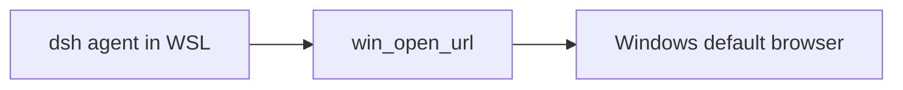

# dsh-wsl-browser
> **Install set:** part of [dsh-wsl-kit](https://github.com/173787247/dsh-wsl-kit). Prefer `KIT_SET=daily` | `llm` | `github` | `full` (see kit README). Fault tree: [TROUBLESHOOTING.md](https://github.com/173787247/dsh-wsl-kit/blob/master/docs/TROUBLESHOOTING.md).


DeepSeek Harness tool: **`win_open_url`** — open an `http` / `https` URL in the **Windows default browser** from WSL.

Part of **[dsh-wsl-kit](https://github.com/173787247/dsh-wsl-kit)**.

[中文说明 → README.zh.md](./README.zh.md)

## Where it sits

Opens an http(s) URL in the Windows default browser. It does not fetch the page inside WSL.



Suite diagram and version snapshot: [dsh-wsl-kit](https://github.com/173787247/dsh-wsl-kit#how-the-pieces-fit). This plugin is **0.1.0** (daily; also in llm). Do not copy that matrix into this README.


---
## Compatibility

| Field | Value |
|-------|-------|
| **Plugin** | `dsh-wsl-browser` **0.1.0** |
| **Minimum dsh** | ≥ **0.1.2** (web UI one-shot `?token=` on Windows relay `:3081`) |
| **Latest verified** | See [dsh-wsl-kit Compatibility](https://github.com/173787247/dsh-wsl-kit#compatibility-2026-09) (currently **`0.1.5-rc.1`**) — single source of truth for the suite |
| **Kit set** | `daily` (also in `github` / `full`; fetch+net also in `llm`) |
| **Cloud Flash** | Use model id **`deepseek-flash`** (V4.1 Flash) in `~/.dsh/settings.yaml` / `llm-deepseek` — not configured by this plugin |
| **Agent Teams** | Upstream experimental; not required here |

Suite floor versions: kit [`check-plugin-versions.sh`](https://github.com/173787247/dsh-wsl-kit/blob/master/scripts/check-plugin-versions.sh). Fault tree: [TROUBLESHOOTING.md](https://github.com/173787247/dsh-wsl-kit/blob/master/docs/TROUBLESHOOTING.md).

## Why

Services started in WSL (`http://127.0.0.1:3080`, docs sites, etc.) should open on the Windows side where you already work. Only `http`/`https` are allowed (no `file:`).

If localhost forwarding fails, the result may include a hint using the current WSL IP—pair with [dsh-wsl-port](https://github.com/173787247/dsh-wsl-port) for deeper diagnosis.

## Tool

| Arg | Required | Meaning |
|-----|----------|---------|
| `url` | yes | `http://` or `https://` URL |

## Install

```sh
dsh plugin --profile web add github:173787247/dsh-wsl-browser
```

## Config

```yaml
- id: dsh-wsl-browser
  name: dsh-wsl-browser
  config:
    timeoutMs: 15000
```

## Test

```sh
npm test
```

## License

MIT
